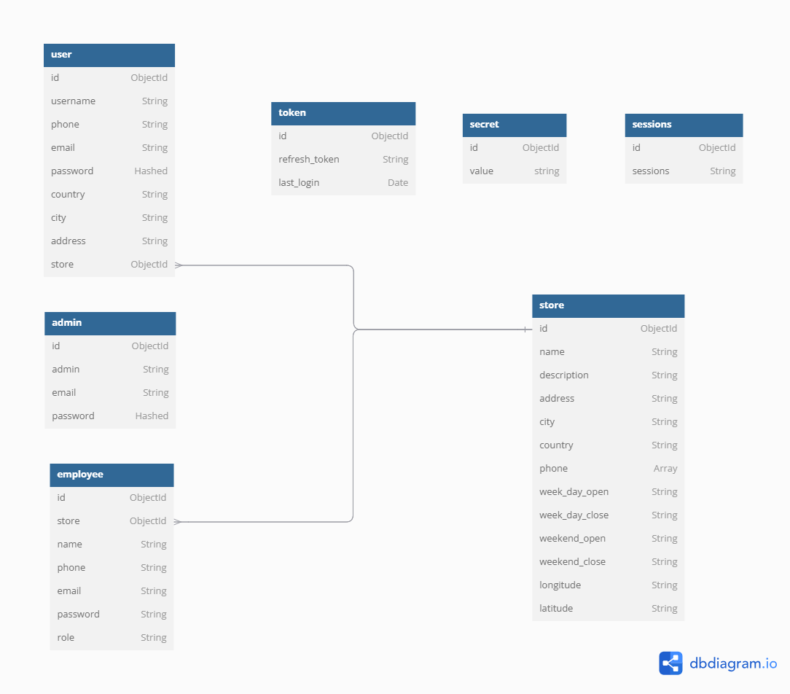
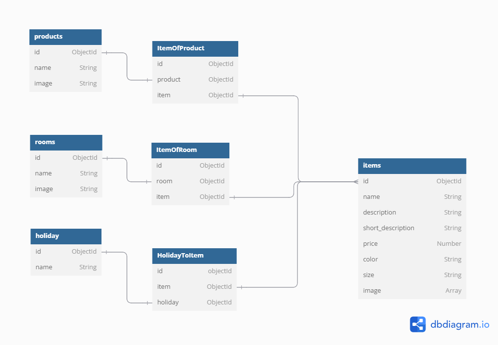
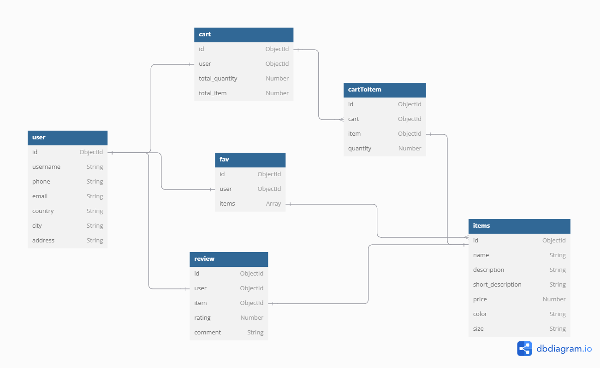
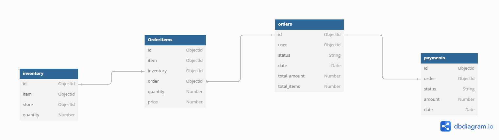

# 1. DATABASE DESIGN FOR IKEAR PROJECT

- [1. DATABASE DESIGN FOR IKEAR PROJECT](#1-database-design-for-ikear-project)
  - [1.1. Customer Authentication, User management and Store management](#11-customer-authentication-user-management-and-store-management)
  - [1.2. Product Catalog Service and Inventory management](#12-product-catalog-service-and-inventory-management)
  - [1.3. Cart management, Favorite List and Review Management](#13-cart-management-favorite-list-and-review-management)
  - [1.4. Order Management - Payment Processing](#14-order-management---payment-processing)
  - [1.5. Delivery and Logistics](#15-delivery-and-logistics)
  - [1.6 Asset containing service](#16-asset-containing-service)

## 1.1. Customer Authentication, User management and Store management

- Manages user logins, profiles, and roles.
- Manages store information



- Details:

```text
Table user {
  id ObjectId
  username String
  phone String
  email String
  password Hashed
  country String
  city String
  address String
  store ObjectId [ref: > store.id]
}

Table employee {
  id ObjectId
  store ObjectId [ref: > store.id]
  name String
  phone String
  email String
  password String
  role String
}

Table token {
  id ObjectId
  refresh_token String
  last_login Date
}

Table sessions {
  id ObjectId
  sessions String
}

Table store {
  id ObjectId
  name String
  description String
  address String
  city String
  country String
  phone Array
  week_day_open String
  week_day_close String
  weekend_open String
  weekend_close String
  longitude String
  latitude String
}
```

## 1.2. Product Catalog Service and Inventory management

- Manages product listings, descriptions, and categories.
- Tracks stock levels and updates availability across stores and online.



- Details:

```text
Table items {
  id ObjectId
  name String
  description String
  short_description String
  price Number
  color String
  size String
  image Array
}


Table products {
  id ObjectId
  name String
  image String
}

Table rooms {
  id ObjectId
  name String
  image String

}

Table ItemOfRoom {
  id ObjectId
  room ObjectId [ref: - rooms.id]
  item ObjectId [ref: < items.id]
}


Table ItemOfProduct {
  id ObjectId
  product ObjectId [ref: - products.id]
  item ObjectId [ref: < items.id]
}

Table holiday {
  id ObjectId
  name String
  image String
}

Table HolidayToItem {
  id objectId
  item ObjectId [ref: < items.id]
  holiday ObjectId [ref: - holiday.id]
}

Table store {
  id ObjectId
  name String
  description String
  address String
  city String
  country String
  phone Array
  week_day_open String
  week_day_close String
  weekend_open String
  weekend_close String
  longitude String
  latitude String
}

Table StoreToItem {
  id ObjectId
  item ObjectId [ref: > items.id]
  store ObjectId [ref: > store.id]
  quantity Number
}
```

## 1.3. Cart management, Favorite List and Review Management

- Handling customer cart and favorite list
- Handling review of customer about items



- Details:

```text
Table user {
  id ObjectId
  username String
  phone String
  email String
  country String
  city String
  address String
}

Table items {
  id ObjectId
  name String
  description String
  short_description String
  price Number
  color String
  size String
  image Array
}

Table cart {
  id ObjectId
  user ObjectId [ref: - user.id]
  total_quantity Number
  total_item Number
}

Table cartToItem {
  id ObjectId
  cart ObjectId [ref: > cart.id]
  item ObjectId [ref: - items.id]
  quantity Number
}

Table fav {
  id ObjectId
  user ObjectId [ref: - user.id]
  items Array [ref: < items.id]
}

Table review {
  id ObjectId
  user ObjectId [ref: - user.id]
  item ObjectId [ref: - items.id]
  rating Number
  comment String
}
```

## 1.4. Order Management - Payment Processing

- Handles customer orders, updates, and tracking.
- Handles secure payments, refunds, and invoicing



- Details:

```text
Table orders {
  id ObjectId
  user ObjectId [ref: - user.id]
  store ObjectId
  status String
  date Date
  total_amount Number
  total_items Number
}

Table OrderItems{
  id ObjectId
  item ObjectId
  inventory ObjectId [ref: - inventory.id]
  order ObjectId [ref: > orders.id]
  quantity Number
  price Number
}

Table payments {
  id ObjectId
  user ObjectId [ref: - user.id]
  order ObjectId [ref: - orders.id]
  status String
  amount Number
  date Date
}

Table inventory {
  id ObjectId
  item ObjectId
  store ObjectId
  quantity Number
}

Table user {
  id ObjectId
  username String
  phone String
  email String
  country String
  city String
  address String
}
```

## 1.5. Delivery and Logistics

- Manages shipping, delivery schedules, and tracking.

## 1.6 Asset containing service

- Contain images, assets from all service
