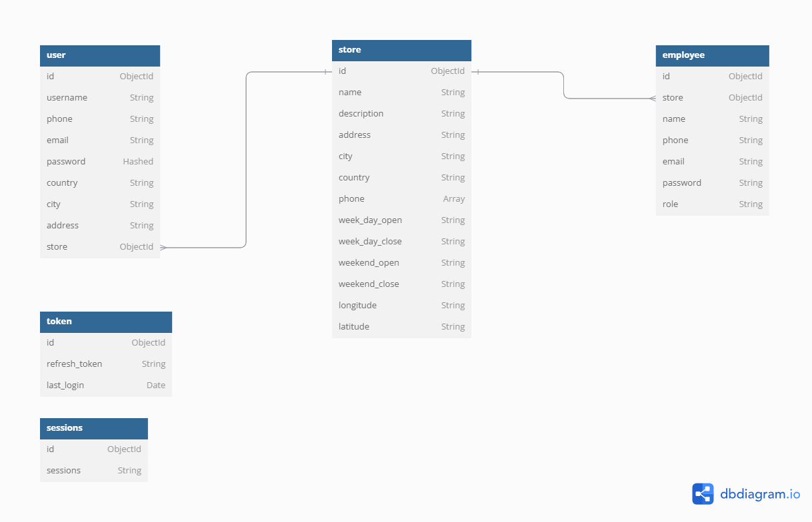

# DATABASE DESIGN FOR IKEAR PROJECT

## Product Catalog Service

- Manages product listings, descriptions, and categories.

## Inventory Management

- Tracks stock levels and updates availability across stores and online.

## Order Management - Payment Processing

- Handles customer orders, updates, and tracking.
- Handles secure payments, refunds, and invoicing

## Delivery and Logistics

- Manages shipping, delivery schedules, and tracking.

## Customer Authentication, User management and Store management

- Manages user logins, profiles, and roles.
- Manages store information



- Details:

<hr/>
  
``` text
Table user {
  id ObjectId
  username String
  phone String
  password Hashed
  country String
  city String
  address String
  store ObjectId [ref: > store.id]
}

Table admin {
id ObjectId
admin String
email String
password Hashed
}

Table employee {
id ObjectId
_store ObjectId [ref: > store.id]
name String
phone String
email String
password String
role String
}

Table token {
id ObjectId
refresh_token String
last_login Date
}

Table sessions {
id ObjectId
sessions String
}

Table store {
id ObjectId
name String
description String
address String
city String
country String
phone Array
week_day_open String
week_day_close String
weekend_open String
weekend_close String
}

Table secret {
id ObjectId
value string
}

```


