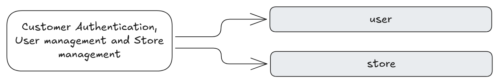

# 1. System design for microservice for IKEAR projects

- [1. System design for microservice for IKEAR projects](#1-system-design-for-microservice-for-ikear-projects)
  - [1.1. Overview design](#11-overview-design)
  - [1.2. Details for IKEAR system](#12-details-for-ikear-system)
    - [1.2.1. Customer Authentication, User management and Store management](#121-customer-authentication-user-management-and-store-management)
    - [1.2.2. Product Catalog Service and Inventory Management](#122-product-catalog-service-and-inventory-management)
    - [1.2.3. Cart management, Favorite List and Review Management](#123-cart-management-favorite-list-and-review-management)
    - [1.2.4. Order Management - Payment Processing](#124-order-management---payment-processing)
    - [1.2.5. Delivery and Logistics](#125-delivery-and-logistics)

## 1.1. Overview design

- Design for 5 services for the system

- All queues needed for project

## 1.2. Details for IKEAR system

### 1.2.1. Customer Authentication, User management and Store management

### 1.2.2. Product Catalog Service and Inventory Management

### 1.2.3. Cart management, Favorite List and Review Management

### 1.2.4. Order Management - Payment Processing

### 1.2.5. Delivery and Logistics
